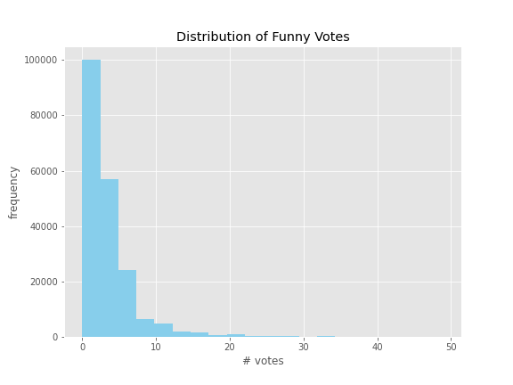
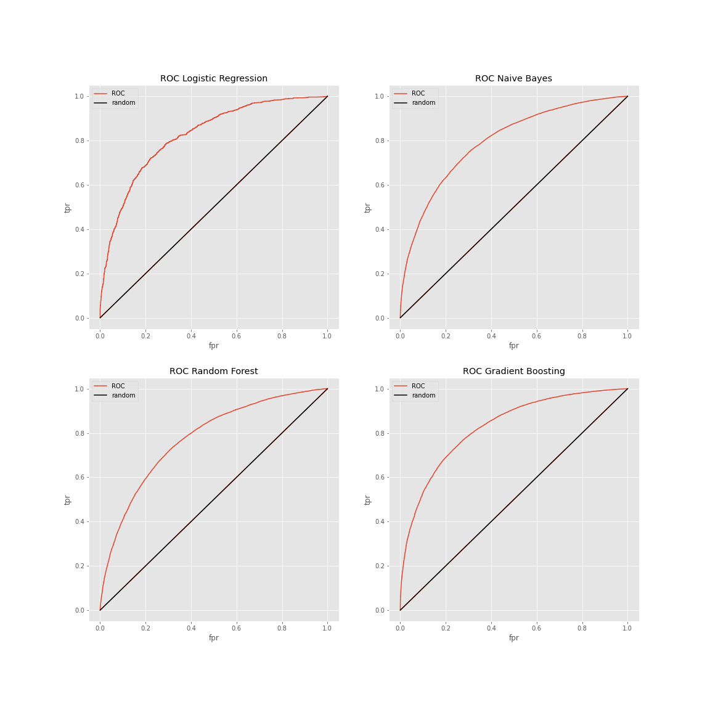

# Predicting-Humor-in-Yelp-Reviews

Use NLP to detect humor in Yelp Reviews

## Motivation ##

Humor is a very human quality and skill, and it’s something we have all experienced at some point. It's also a very subjective thing, but what if there was a way to systematically detect it using data that is readily available to us? To answer this question, I sought to detect humor in the community-based context of Yelp. For this goal I worked with the Yelp Open Dataset, which contains ~8.6 million reviews of businesses on Yelp, each with a 'funny' attribute representing the number of funny votes a given review has received.

This project will create baseline models to predict humor in Yelp Reviews using classic machine learning methods. Useful applications include helping business owners better understand user engagement with their business. It can also signal to other users about the exaggerated nature of humorous reviews, and that such reviews should be taken with a grain of salt.

Perhaps most interestingly, there is potential to incorporate humor in AI systems to make human-computer interactions feel more human.

## Defining Humor ##

A look at the histogram for the distribution of the 'funny' column (up to 50 votes) shows a heavy left skew, with the majority of review having 0 votes. The number of votes ranged up to 610.

After examining individual reviews, 3 votes seemed to be a good cut-off for defining whether a review is humorous to account for noise in 1 and 2 vote reviews. Using this definition, only 340,864 out of 8,635,403 total reviews are considered funny. I chose to turn this into a binary classification problem of funny vs not funny, and used undersampling to create a balanced dataset of 200k reviews total, 100k each of funny/not funny, to make model results interpretable.

## Data and Text Processing ##

The data was downloaded from the Yelp website. A preview of the data after removing irrelevant columns can be found in 'fakedata.csv'. 

## Modeling and Evaluation ##

